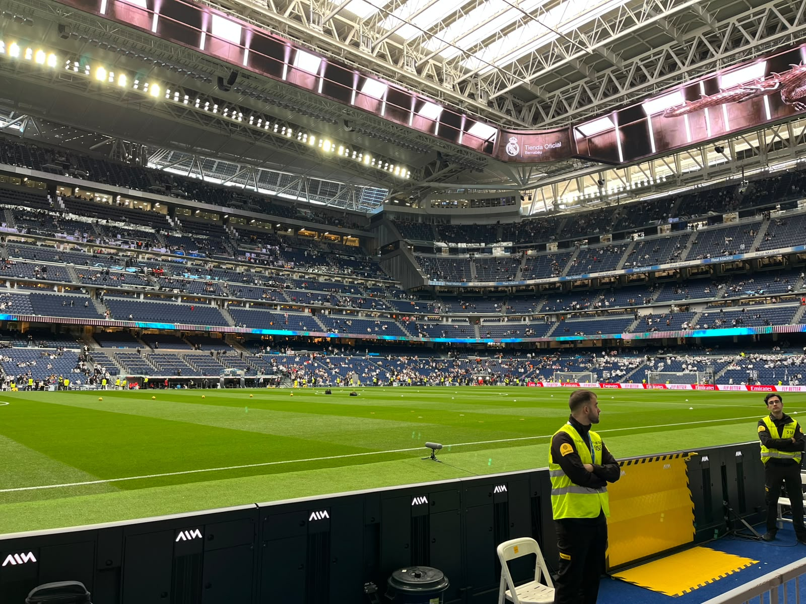
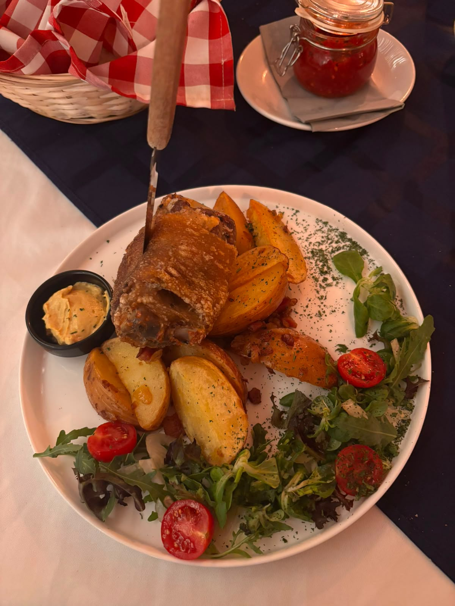
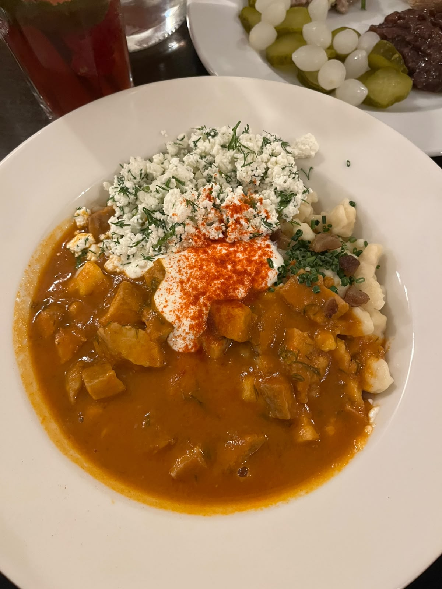
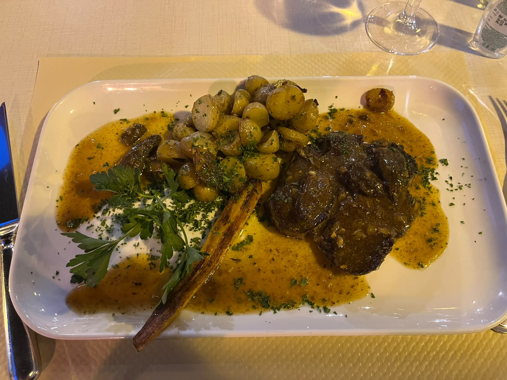
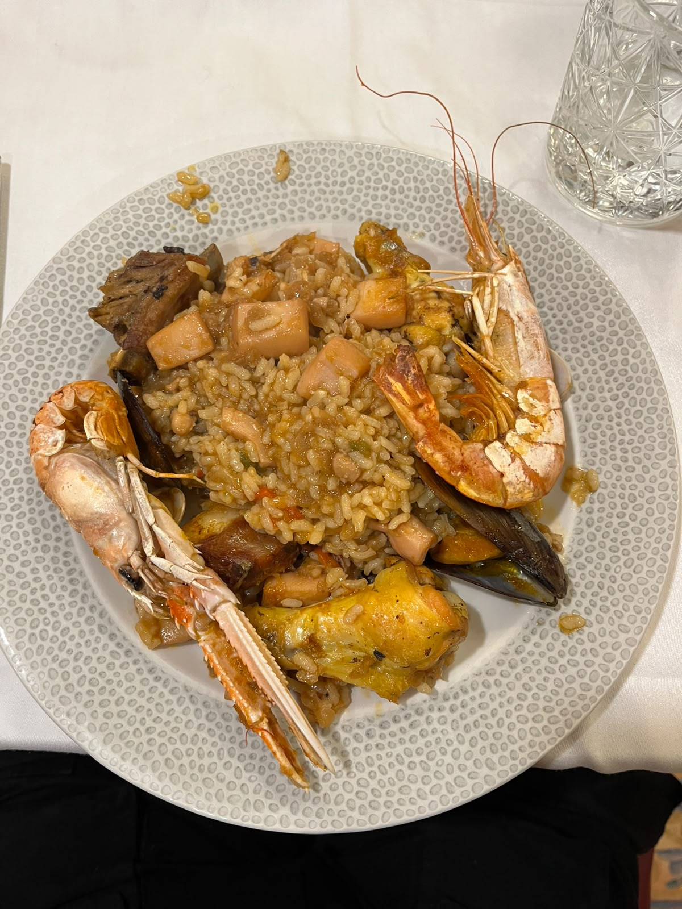
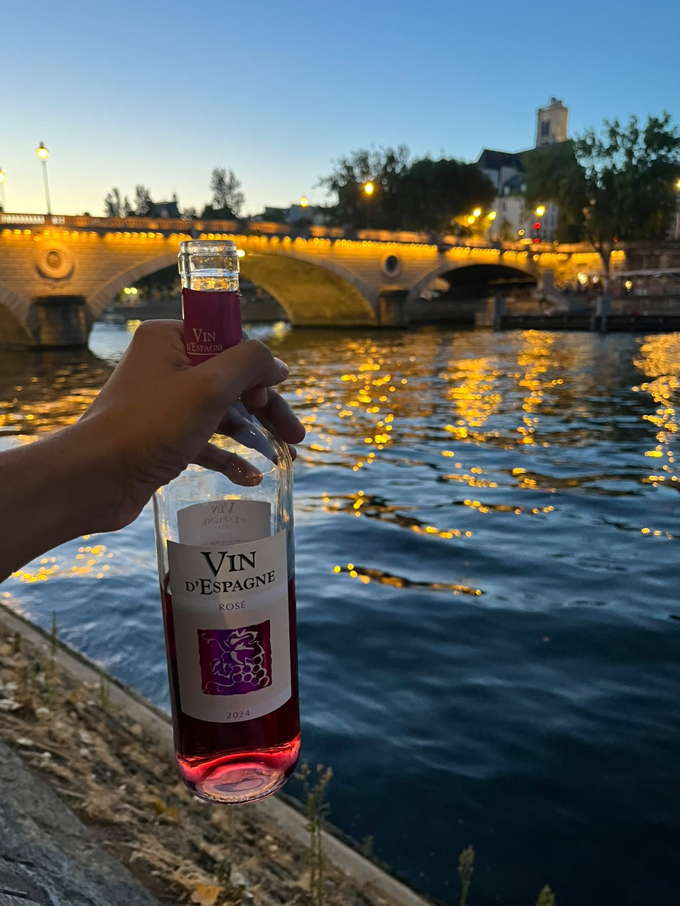
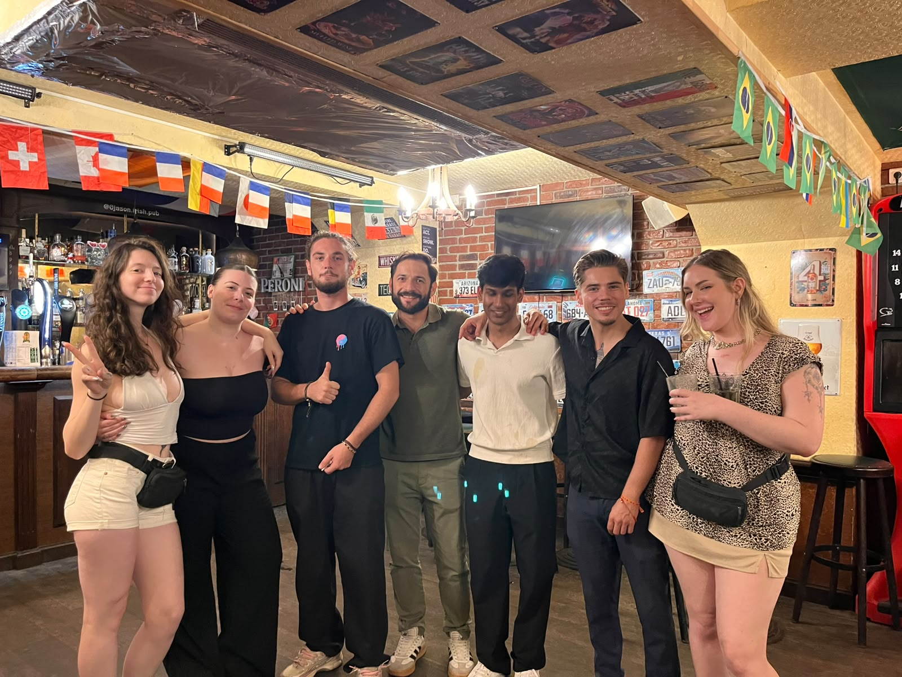
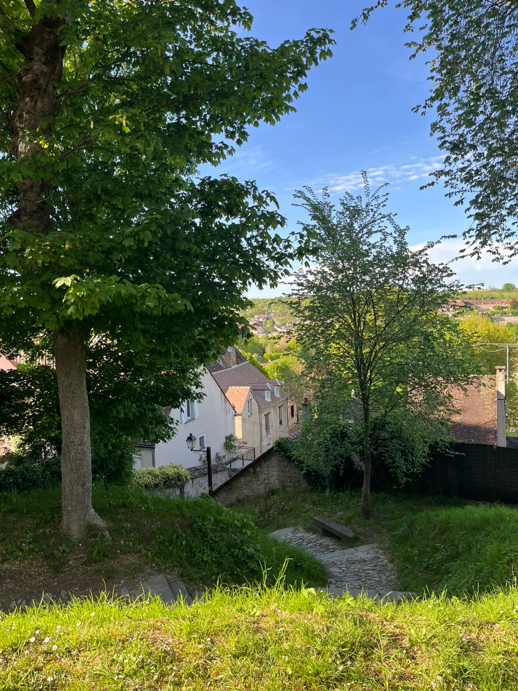
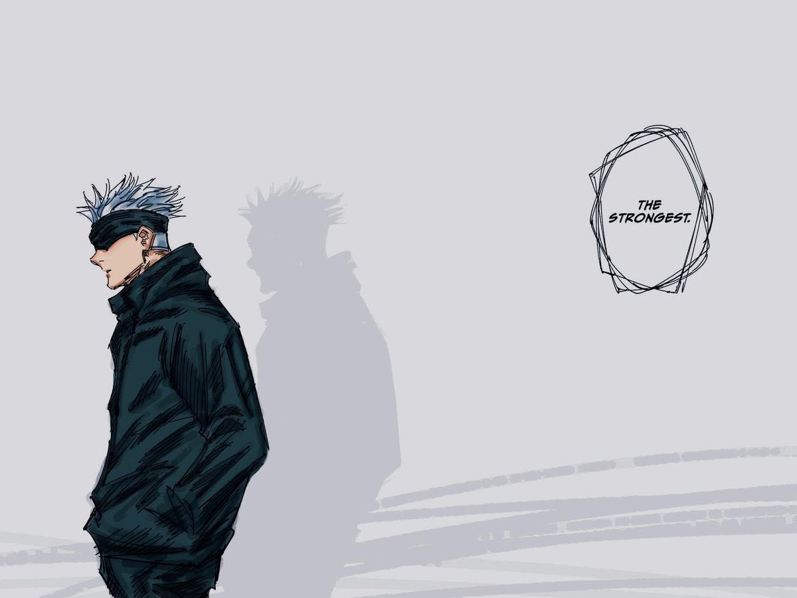

Outside of mathematics, I have quite a few interests that I pursue in my free time. I absolutely love watching and playing football. I've been watching Real Madrid since 2010 and try my best not to miss a single match. Below is an image I took inside the Santiago Bernabéu stadium during a visit in 2023 where they played Girona and I got to witness Modric's last goal for the club.

::: {.interest-gallery}
{.interest-thumb}
:::

I am a HUGE foodie and absolutely love trying out new cuisines and dishes. I also enjoy cooking and experimenting with recipes in my kitchen. Below are some images of food that I've tried and enjoyed during my travels.

::: {.interest-gallery}
{.interest-thumb}

{.interest-thumb}

{.interest-thumb}

{.interest-thumb}
:::

If you're ever in Paris, I highly recommend getting wine or beer drunk by the Seine. It's the perfect spot to go on romantic dates or just hang out with your friends. My favourite spot in particular is Quai Saint-Bernard, which is a small quay on the right bank of the Seine. You find lots of people dancing at night and playing music. Just a few minutes walk away is my favourite pub O'Jasons, which has the best bartenders and Guiness in Paris. The picture below is from inside the pub with my friend Camil and all the bartenders (I request you to ignore the stains in my shirt, I spilled a lot of alcohol while dancing that night).

::: {.interest-gallery}

{.interest-thumb}

{.interest-thumb}
:::

Also highly recommend visitng Provins, a small medieval town just an hour and half away from Paris. It's a cute little town with plenty of medieval architecture and a lot of history. It's a great place to go for a day trip and just relax.

::: {.interest-gallery}
{.interest-thumb}
:::

Finally, I am a huge fan of anime and manga. I don't watch as much as I used to back in 2020, but I still keep up with new seasons/chapters of my favourite series. It's hard to pick a favourite anime, so I am attaching my [MyAnimeList](https://myanimelist.net/profile/ayaneshlal) profile if you want to check out my list of favourite animes, mangas and characters or just add me as a friend there. I also have [Instagram](https://www.instagram.com/1ay7n/) and [Youtube](https://www.youtube.com/@1ay7n) channels where I post anime edits (I haven't posted anything in years but will start again soon) which you could check out if you'd like.

::: {.interest-gallery}
{.interest-thumb}
:::

