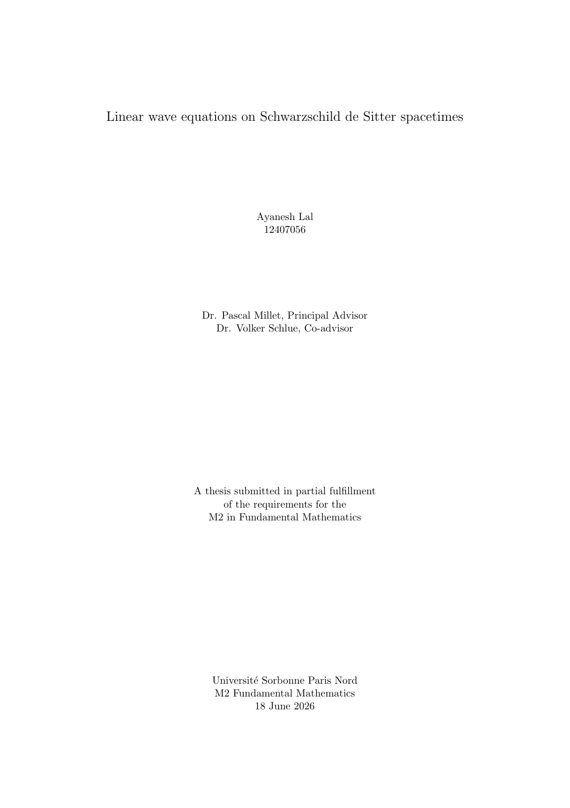
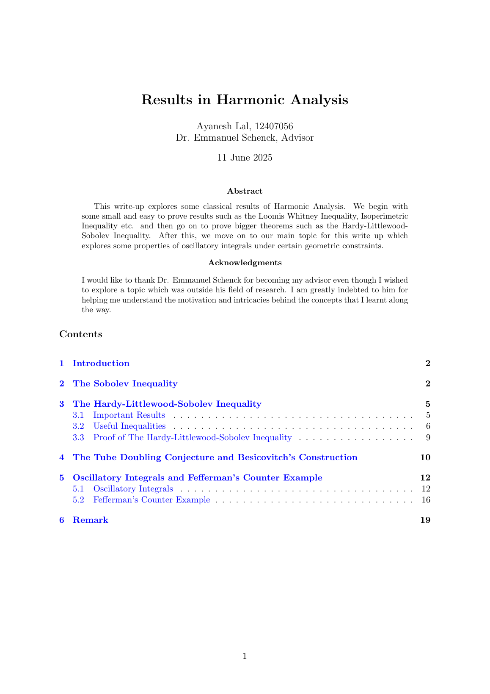
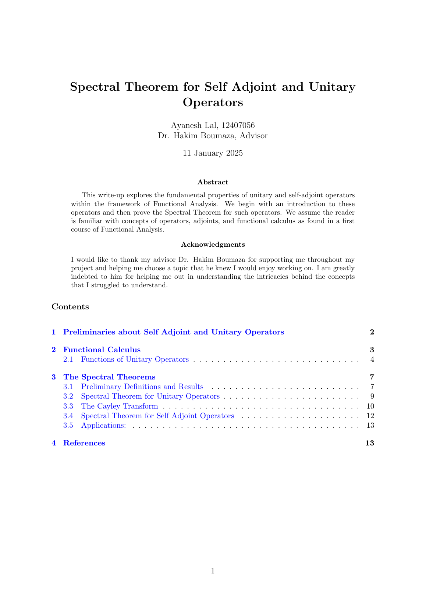
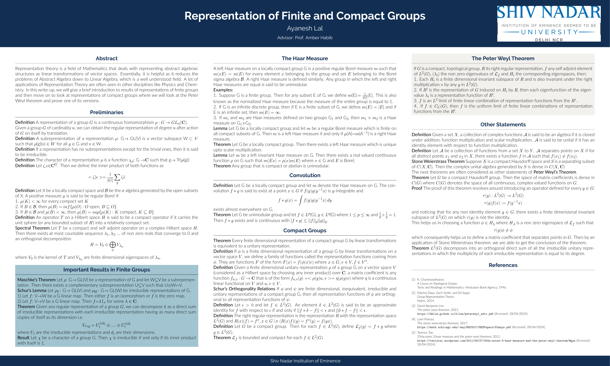
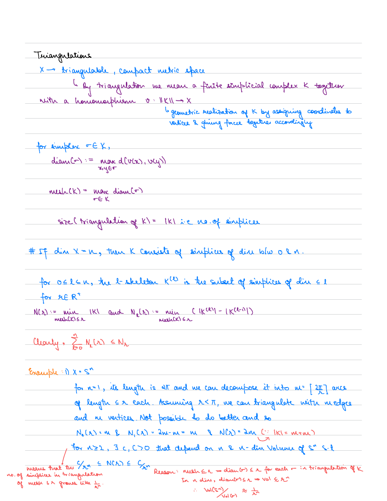

These are a few pieces of mathematical write ups that I am particularly happy with and which could possibly act as expository stuff regardless of their primary purpose. A more complete list of my work, including  slides and other projects can be found [here](https://drive.google.com/drive/folders/1IOAVUrbc99RIYO36hk2DEndG1sL8Y0RU?usp=sharing). I plan to create a "Research" page when I have original research work to share, but for now this page is a collection of my expository writings and reports from various projects and seminars.

## Linear Wave Equations on Schwarzschild–de Sitter Spacetimes

:::: {.columns .writing-entry}

::: {.column width="28%"}
{.writing-preview}
:::

::: {.column width="72%"}
*This thesis studies linear wave equations on Schwarzschild–de Sitter spacetimes using spectral theory and microlocal analysis. It develops the geometric and analytic framework behind wave propagation on black-hole backgrounds, with particular attention to radial point estimates and Fredholm theory.*

[Read the thesis](files/writing/m2-thesis.pdf){.btn .btn-outline-primary target="_blank"}
:::

::::

## Results in Harmonic Analysis

:::: {.columns .writing-entry}

::: {.column width="28%"}
{.writing-preview}
:::

::: {.column width="72%"}
*This write-up begins with classical geometric and analytic results such as the Loomis–Whitney, isoperimetric, Sobolev, and Hardy–Littlewood–Sobolev inequalities, before moving to oscillatory integrals and geometric constraints. The main part studies the failure of certain $L^p$ estimates for oscillatory convolution operators through Fefferman's counterexample.*

[Read the report](files/writing/harmonic-analysis.pdf){.btn .btn-outline-primary target="_blank"}
:::

::::

## Spectral Theorem for Self-Adjoint and Unitary Operators

:::: {.columns .writing-entry}

::: {.column width="28%"}
{.writing-preview}
:::

::: {.column width="72%"}
*This report develops the basic theory of self-adjoint and unitary operators in functional analysis and proves their spectral theorems, using functional calculus and the Cayley transform as central tools.*

[Read the report](files/writing/spectral-theorem.pdf){.btn .btn-outline-primary target="_blank"}
:::

::::

## Representation of Finite and Compact Groups

:::: {.columns .writing-entry}

::: {.column width="28%"}
{.writing-preview}
:::

::: {.column width="72%"}
*Poster from my undergraduate research project on representation theory of finite and compact groups. The project began with representations of finite groups and continued through Haar measure, compact groups, and the Peter–Weyl theorem, culminating in a proof of versions of the Peter–Weyl theorem.*

[View the poster](files/writing/ug-thesis-poster.pdf){.btn .btn-outline-primary target="_blank"}
:::

::::

## Wasserstein Stability for Lipschitz Functions

:::: {.columns .writing-entry}

::: {.column width="28%"}
{.writing-preview}
:::

::: {.column width="72%"}
*Handwritten notes prepared for a seminar on David Cohen-Steiner's work on stability in persistent homology. The talk introduced triangulations, Lipschitz functions, persistence diagrams, and the ideas underlying Wasserstein stability for Lipschitz functions.*

[View the handwritten notes](files/writing/topological-data-analysis-notes.pdf){.btn .btn-outline-primary target="_blank"}
:::

::::